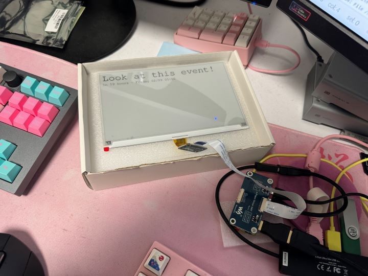

# Next Event Display

An in-progress project to display upcoming events on a permenantly installed display in the Chatham Immersive Media space.

## Hardware
- Raspberry Pi Zero W 2
- [Waveshare 7.5in E-Ink display with HAT](https://www.waveshare.com/product/7.5inch-e-paper-hat.htm)

## Software
- Using [waveshare_epd](https://github.com/waveshareteam/e-Paper/tree/master/RaspberryPi_JetsonNano/python) python library.
- The Font is [FreeMono](https://www.gnu.org/software/freefont/)
- [ics.py](https://icspy.readthedocs.io/en/stable/) to parse the calendar
- [Arrow](https://arrow.readthedocs.io/en/latest/) for date/time fiddling and humanization
- [Pillow](https://pillow.readthedocs.io/en/stable/) for creating the image that is sent to the display
